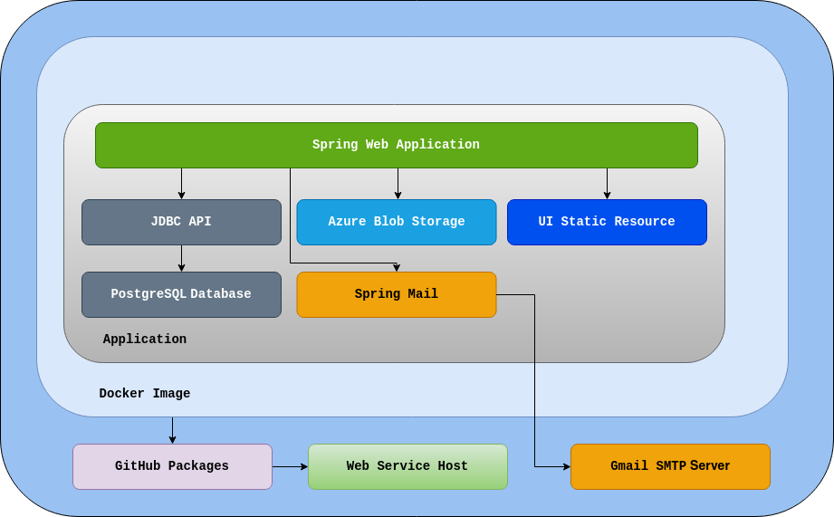
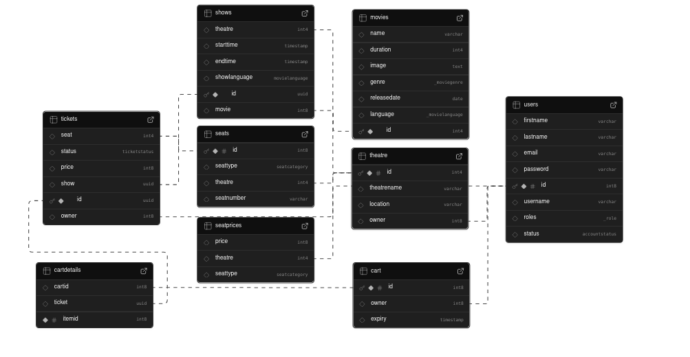

# Backend for Movie Reservation System

## Built with:

- Spring Web
- Spring Security
- Spring Mail
- PostgreSQL
- Azure Blob Storage
- Docker
- JDBC API
- PostgreSQL extension pg_cron


## System Architecture


## Database



## Features
### General
- **Security**: Spring Security is enabled. CSRF tokens are distributed using secure, same-site cookies, access to operations is user role-based and defined using API request matchers
- **Account verification by E-mail**: URLs containing **JWT** tokens used to activate new accounts. Emails sent using Gmail SMTP server
- **Azure Blob Storage**: posters of movies present in the database are stored here and fetched via a public link
- **Cart Expiry**: Cart expires and its items are removed after 30 minutes using PostgreSQL cron-like extension pg_cron
- **Swagger integration**: available at: /swagger-ui/index.html


### User Accounts
- Users can create multi-role accounts as Customers, Theatre Operators, or both.
- Account verification is done via e-mail for new accounts.
- Accounts are disabled until they have been verified by e-mail. 
- Admin accounts cannot be created via web application, and need to be created internally. 

#### When not signed-in (anyone)
- View movies and their ongoing shows
- Filter movies by genre, language, release date

#### Customer
- View tickets for a show
- Add/remove tickets from cart
- Book/cancel tickets
- View their current/past tickets
- Cannot have more than 10 items in the cart

#### Theatre Operator
- Can view a list of their theatres
- Create new theatres
- Can view ongoing shows
- Cancel shows

#### Admin
- Add new movies
- Create tickets for an existing show


## Installation

### To run the application
- **Please see notes below before proceeding further**
- Install docker 
- Navigate to project directory and run the docker command: 
```
docker build -t <repository_name>/<image_name>:<tag> .
```
- Gather the environment variables as defined in src/main/resources/application.properties into an .env file
- Launch docker container using: 
```
docker run --env-file <path_to_env_file> --rm -p 8080:8080 <repository_name>/<image_name>:<tag>
```

### To run tests
- Setup project dependencies
- Navigate to project directory and run the command
```
mvn test
```

## Notes:
- For development environment, local storage is used to store posters, not Azure Blob Storage 
- To include the UI in the docker image, build the UI from [UI repository](https://github.com/loveleenc/movie-system-ui) and copy the files to src/main/resources/static/ before building the Docker image